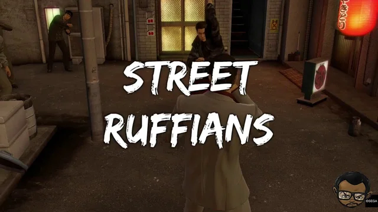

# TODO:
Animation fixes: 
- Don't color in a player as the dealer until animations are finished.
- The dealer shuffle indicator (the yellow rectangle) doesn't match the player cards. 

Change End Game:
- Make a Game Over popup. Display the results of the game.

User Profiles:
- Save their recent game results. Nothing too fancy, just save the date played, their points at the end of the game, and whether they were first-fourth place.

UI Changes:
- GameBoardView: I want a Splash text/title card to appear. It's a simple large text that shows in the middle of the screen, on top of everything, in white with a black border. 
    - This text will indicate gamestate changes. In particular:
        - "Shuffling Players" when shuffling players
        - "Selecting the Dealer" when selecting dealer
        - "East Round 2" when going from Round 1 -> Round 2
    - It'll look like this:
    

- Score Hand menu: For the winner picker, color code the usernames as well. Discarder should be the exact same segmented picker style as winner as well.

